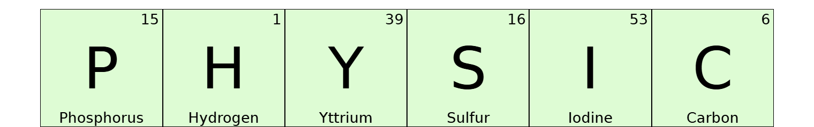

# ✨ Who am I?

I'm **Khylian Griffon**, a passionate **Web Developer** and **Video Editor** specializing in both web development and creating visually engaging content. Currently studying at SupInfo, I aim to strengthen my skills while working on exciting projects. I'm actively seeking an internship to further hone my expertise in web development and contribute to innovative digital projects.

🚀 **What I Do**
- 🔥 **Web Development** (Frontend & Backend)
- 🎥 **Video Editing & Motion Designer**
- 💡 Enthusiast about **modern web technologies** and **creative media**
- 🛠️ Always experimenting with new tools, and digital solutions
- 🎓 Currently studying at **SupInfo**, specializing in Web Development and Digital Content Creation

## 💻 Tech Stack

## 📊 GitHub Stats

 

## 🏆 GitHub Trophies

### ✍️ Favorite Dev Quote

> *"The question of whether a computer can think is like the question of whether a submarine can swim."*  
— **Edsger Dijkstra**

## 🎮 GitHub Maze

<!-- Proudly created with GPRM ( https://gprm.itsvg.in ) -->
